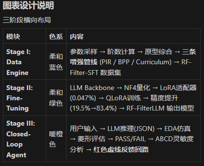

图表设计说明
三阶段横向布局
模块	色系	内容
Stage I: Data Engine	柔和蓝色	参数采样 → 阶数计算 → 原型综合 → 三条增强管线 (PIR / BPP / Curriculum) → RF-Filter-SFT 数据集
Stage II: Fine-Tuning	柔和绿色	LLM Backbone → NF4量化 → LoRA适配器 (0.047%) → QLoRA训练 → 精度提升 (19.5%→83.4%) → RF-FilterLLM 输出模型
Stage III: Closed-Loop Agent	暖橙色	用户输入 → LLM推理(JSON) → EDA仿真 → 菱形评估 → PASS/FAIL → ABCD灵敏度分析 → 红色虚线反馈回路

